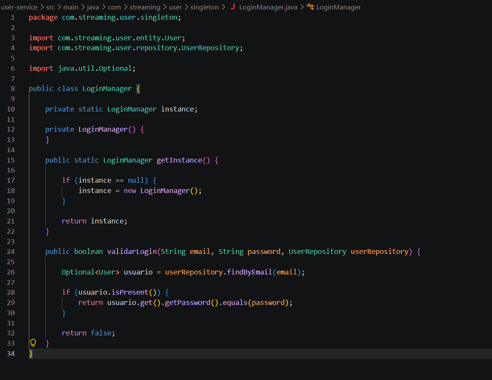
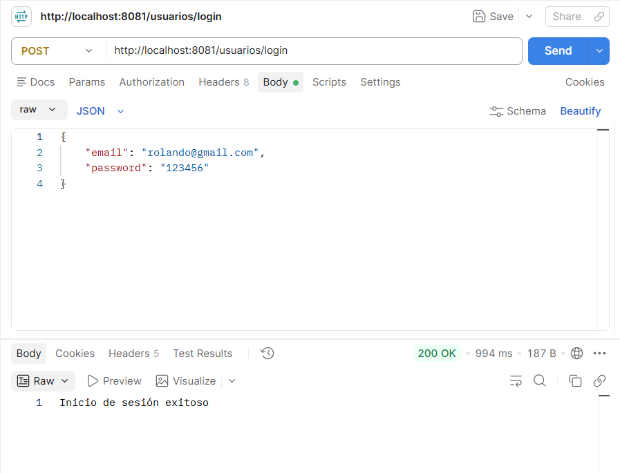

# Plataforma de Streaming de Video

## Descripción del proyecto

Proyecto académico orientado al desarrollo de una plataforma de streaming de video utilizando una **arquitectura basada en microservicios**.

La plataforma permitirá gestionar contenido audiovisual, usuarios y suscripciones, generar recomendaciones de contenido y reproducir videos en diferentes calidades, incorporando un control básico de acceso a los contenidos.

El objetivo principal del proyecto es contar con una aplicación funcional que permita **comprender y aplicar los diferentes patrones de diseño estudiados durante el curso**. Los patrones serán incorporados progresivamente de acuerdo con los temas vistos en clase.

## Módulos principales

- **Gestión de contenido:** administración y organización del catálogo de videos.
- **Usuarios y suscripciones:** registro de usuarios, autenticación y gestión de suscripciones.
- **Recomendación de contenido:** generación de recomendaciones según la actividad y preferencias del usuario.
- **Streaming y derechos digitales:** reproducción de videos en diferentes calidades y control de acceso al contenido.

## Objetivo general

Desarrollar una plataforma académica de streaming de video basada en microservicios que permita gestionar contenido, usuarios, suscripciones, recomendaciones y reproducción adaptativa, con el propósito de estudiar y aplicar los patrones de diseño vistos durante el curso.

## Objetivos específicos

1. Desarrollar un módulo para administrar y organizar el contenido audiovisual de la plataforma.
2. Implementar la gestión de usuarios, suscripciones y recomendaciones de contenido.
3. Implementar la reproducción de contenido en diferentes calidades junto con un mecanismo básico de control de acceso.

## Tecnologías

| Componente | Tecnología |
|---|---|
| Lenguaje | Java |
| Framework | Spring Boot |
| Arquitectura | Microservicios |
| Base de datos | PostgreSQL |
| IDE | Visual Studio Code |
| API | REST |
| Construcción | Maven |
| Pruebas | Postman / JUnit |
| Documentación API | Swagger / OpenAPI |
| Control de versiones | Git + GitHub |
| Streaming | HLS |
| Contenedores | Docker |

## Arquitectura

El proyecto estará dividido en diferentes microservicios, cada uno responsable de una parte específica de la plataforma:

plataforma-streaming/
│
├── user-service
├── content-service
├── recommendation-service
├── streaming-service
├── rights-service
├── frontend
└── docs

## Evidencias de implementación

### Patrón Singleton - LoginManager

Para el proceso de inicio de sesión se implementó el patrón de diseño Singleton mediante la clase `LoginManager`.

El patrón permite garantizar que exista una única instancia de `LoginManager` durante la ejecución de la aplicación.

La siguiente evidencia muestra la implementación del patrón Singleton:

### Prueba del inicio de sesión

Se realizó una prueba del endpoint de inicio de sesión utilizando Postman.

**Método:** POST

**Endpoint:**

`http://localhost:8081/usuarios/login`

Se enviaron las credenciales de prueba y el sistema respondió correctamente con el mensaje:

`Inicio de sesión exitoso`

